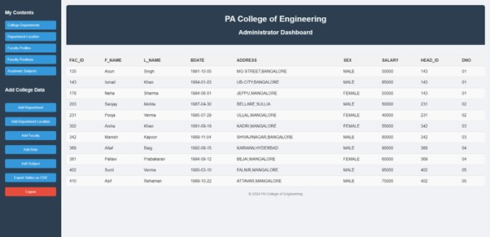

# Faculty Information Management System

## 🧠 Description
A web-based application designed to store, manage, and retrieve faculty records efficiently. Built using PHP and MySQL with a responsive frontend using HTML, CSS, and JavaScript.

## 🚀 Tech Stack
- Frontend: HTML, CSS, JavaScript
- Backend: PHP
- Database: MySQL

## ✨ Features
- Add, update, and delete faculty details
- Search and sort faculty records
- Responsive and user-friendly dashboard

## 🛠️ How to Run
1. Clone the repository: git clone https://github.com/thammi21 Faculty-Information-Management-System.git
2. Import `faculty_database.sql` into your local MySQL server
3. Place project files in your local web server (e.g., `htdocs` in XAMPP)
4. Start Apache & MySQL → visit `localhost/faculty-management`

## 📸 Screenshots

### 🔐 Login Panel

### 📊 Dashboard

### ➕ Add Faculty Data

### 📤 Export as CSV

## 👤 Author
**Mohammed Thameem**  
[LinkedIn](https://linkedin.com/in/mohd-thameem) • [GitHub](https://github.com/thammi21)
=======
# Faculty-Information-Management-System
Web-based system to manage faculty records using PHP and MySQL
>>>>>>> fd3e098dbd0a06d2a5306307751b41925219c485
